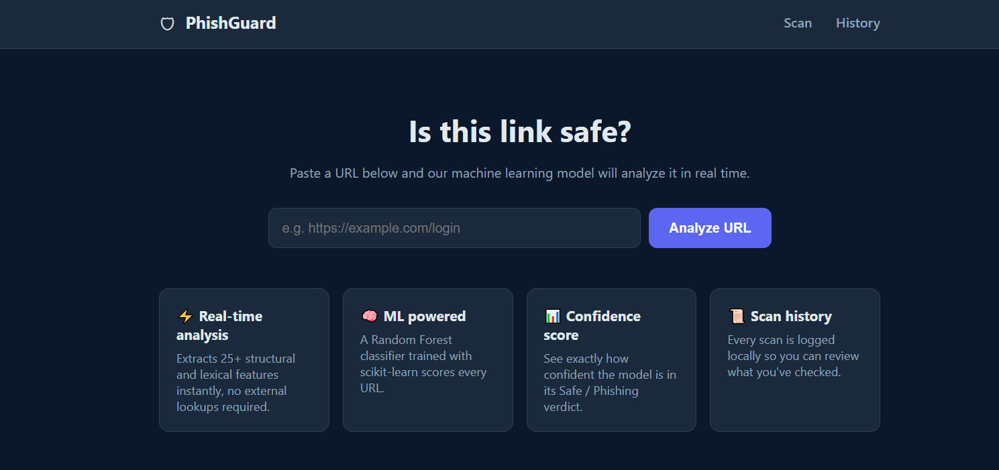
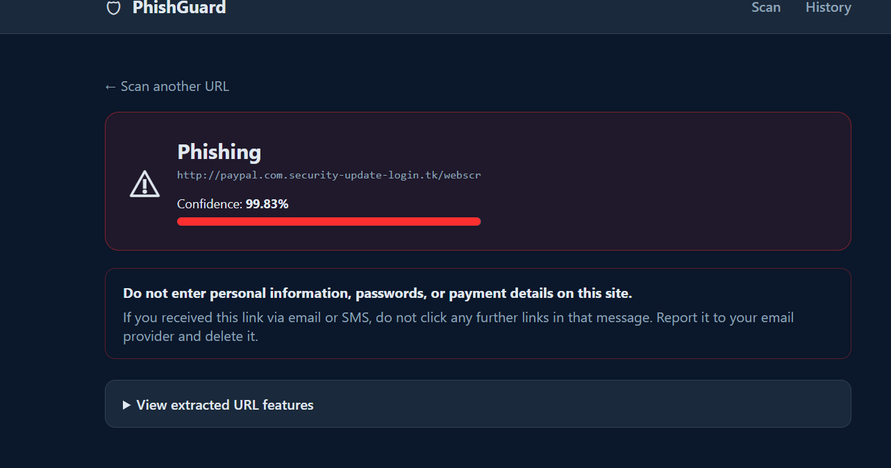
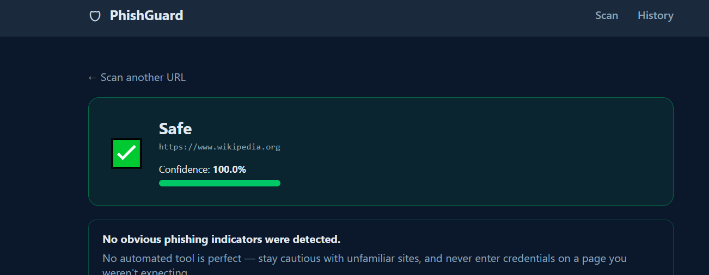

# 🛡️ PhishGuard — Phishing URL Detection System

A web app that analyzes a URL and predicts whether it's **Safe** or **Phishing**
using a machine learning model, with a confidence score and scan history.

**Tech stack:** Python · Flask · pandas · scikit-learn (Random Forest)

---

## Features

- 🔗 Clean web UI to submit a URL for analysis
- ⚡ Automatic extraction of 25 lexical/structural URL features — no external network calls needed
- 🤖 Random Forest model trained with scikit-learn
- ✅ Safe / Phishing verdict with a confidence score
- 🗂️ Local scan history (SQLite) with a clear-history option
- 🔌 JSON API endpoint (`/api/predict`) for real-time / programmatic use


## Screenshots

### Home page


### Phishing detected


### Safe result


---


---

## Getting started

### 1. Clone the repo
```bash
git clone https://github.com/gupta-2005/Phishguard.git
cd Phishguard
```

### 2. Install dependencies
```bash
python -m pip install -r requirements.txt
```

### 3. Generate the training dataset and train the model
```bash
python generate_dataset.py
python train_model.py
```

### 4. Run the app
```bash
python app.py
```
Open **http://localhost:5000** in your browser.

---

## License

This project is licensed under the [MIT License](LICENSE).